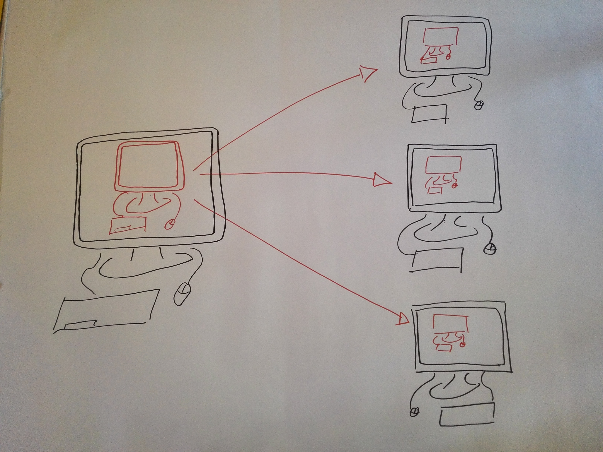
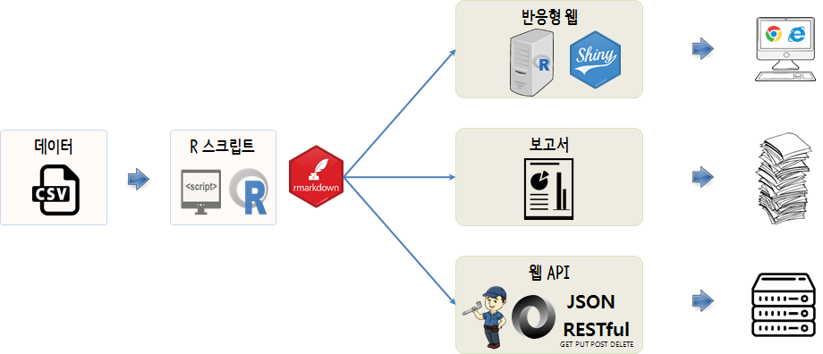
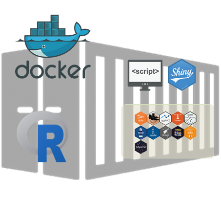

> ## 학습목표 
> - 도커가 출현한 기본개념을 이해한다. 
> - 도커가 왜 유용성한지 그 이유를 이해한다.


## 1. 그런데 내가 왜 도커를 사용해야 하나? {#docker-why}

여러분이 R로 데이터를 분석한 뒤에 작업한 코드를 친구에게 전송했다고 가정한다.
친구가 정확하게 동일한 데이터셋에 정확하게 동일한 코드를 실행했지만, 결과는 다소 
차이가 나는 결과를 얻는 것은 심심치 않게 목도하게 된다.
이유는 다양한 곳에서 찾을 수 있다: 서로 다른 운영체제, 다른 R 팩키지 버젼 등.
도커는 이와같은 유형의 문제를 풀고자 한다.


**도커 컨테이너는 여러분 컴퓨터 내부에 또다른 컴퓨터로 간주할 수 있다**. 
가상 컴퓨터에 대해서 정말 멋진 기능은 컴퓨터를 친구에게 보낼 수 있다는 것이다;
따라서, 친구가 가상 컴퓨터를 받아 코드를 실행하게 되면, 정확하게 동일한 결과를 얻게 된다는 점이다.


 
간략하게 줄여서, 도커를 사용해야되는 이유는...


- 운영체제부터 R과 $LaTeX$ 팩키지 버젼같은 세부적인 사항과 연관된 **의존성 문제**를 풀수 있게 해 준다.
- 분석결과가 **재현가능**함을 확실히 보장한다.

도커가 그외에도 도움이 될 수 있는 몇가지 점이 있다:

- **이식성(Portability)**: 도커 컨테이너를 쉽게 또다른 컴퓨터에 보낼 수 있기 때문에,
본인 컴퓨터에서 거의 모든 것을 설정하고 작업준비를 완료한 다음에 훨씬 더 강력한
슈퍼컴퓨터에서 분석코드를 실행시킬 수 있다.
- **공유성(Sharability)**: 도커 컨테이너를 (도커로 작업할 수 있는 방법을 아는) 누구에게나 전달할 수 있다.

## 2. 기본 용어사전 {#docker-terminology}

*이미지(image)*와 *컨테이너(container)* 두단어는 학습과정 내내 지속적으로 반복되어 나온다.
이미지에 대한 인스턴스를 컨테이너라고 부른다. 이미지는 가상컴퓨터에 대한 설정이다.
이미지를 실행하게 되면 이미지에 대한 인스턴스를 갖게 되는데 이를 컨테이너라고 부른다.
동일한 이미지에 다수 컨테이너를 실행시킬 수 있다.


다음 수업: [수업 02 도커 실행](02-Launching-Docker.html)으로 진행하거나 
[학습목차](index.html)로 되돌아 간다.

## 3. 도커 배포 {#docker-deployment}

데이터 분석과 모형개발의 결과물은 최종 소비자의 유형에 따라 크게 사람과 기계로 나뉘게 된다.
의사결정을 위한 보고서인 경우는 당연히 사람이 되고, 인터랙티브하게 데이터를 탐색하고자 하는 경우 반응형 웹으로 개발된 웹서버에서 서비스 형태로 제공된다.
마지막으로 모형의 결과물일 경우 또 다른 기계(컴퓨터)에서 받아가기 좋은 형태로 예를 들어 예측모형 확률 혹은 점수(Score)를 JSON 형태 Restful API로 제공된다.



이와 같은 경우, 로컬 컴퓨터에서 배포 서비스 환경을 동일하게 상정하고 이를 개발하고 나서 서버에 Shiny를 설치하여 반응형 웹앱 형태로 서비스를 제공한다. 

### 3.1. 도커 이미지 {#docker-images}

[rocker - Rocker Project](https://hub.docker.com/u/rocker/) 도커 허브에 가면 데이터 과학 제품 개발을 위한 `rstudio` IDE와 함께 
`shiny` 도커 이미지가 제공된다. `tidyverse`를 주된 개발환경으로 사용하는 경우 `rocker/tidyverse`도 가져와서 활용하면 좋다.

- rocker/tidyverse: `docker pull rocker/tidyverse`
- rocker/rstudio: `docker pull rocker/rstudio`
- rocker/shiny: `docker pull rocker/shiny`

### 3.2. RStudio IDE, Shiny 서버 {#docker-rstudio-shiny}

`docker pull` 명령어로 도커 이미지를 가져왔다면, 도커 인스턴스를 생성하고 이를 사용하자.

1. **RStudio IDE**를 띄워 사용할 경우 `docker run` 명령어를 실행하고 포드번호 8787을 매칭시키고 `docker pull`로 가져온 이미지에서 `rocker/rstudio` 실행시킨다.
    - `docker run -d -p 8787:8787 -e ROOT=TRUE rocker/rstudio`
1. **Shiny**를 띄워 사용할 경우 `docker run` 명령어를 실행하고 포드번호 3838을 매칭시키고 `docker pull`로 가져온 이미지에서 `-e ADD=shiny` 인자를 넘겨 
`rocker/rstudio` 실행시킨다.
    - `docker run -d -p 3838:3838 -e ADD=shiny rocker/rstudio`
1. **Shiny 디렉토리 동기화**를 위해서 `docker run` 명령어를 실행하고 포드번호 3838을 매칭시키고 `docker pull`로 가져온 이미지에서 `-v /C/shiny:/srv/shiny-server/` 인자를 넘겨 
`rocker/shiny` 실행시킨다. `-v /C/shiny:/srv/shiny-server/` 인자는 호스트 로컬컴퓨터 `C:\shiny` 디렉토리와 도커 콘테이너 `/srv/shiny-server/` 디렉토리를 동기화시킨다.
    - `docker run -d -p 3838:3838 -v /C/shiny:/srv/shiny-server/ rocker/shiny`
1. **Shiny 웹 배포**를 위해서 로컬 컴퓨터에서 개발한 Shiny 웹앱을 `docker cp` 명령어를 통해 `docker run`을 통해 생성된 `stupefied_swirles` 콘테이너 `/srv/shiny-server/` 디렉토리에 앞서 정의한 호스트 로컬 컴퓨터
디렉토리 `C:\shiny` 모든 파일을 복사하여 배포시킨다.
    - 예를 들어, docker cp . stupefied_swirles:/srv/shiny-server/

### 3.3. Shiny 앱 배포 {#docker-rstudio-shiny-deploy}

`rocker/rstudio`, `rocker/shiny` 도커 이미지 기반에 추가로 필요한 팩키지를 설치하고 나서, 개발된 Shiny 앱을 얻어 이를 이미지로 구워서 도커를 통해 배포한다.

``` {r docker-deployment-dockerfile, eval=FALSE}
# rocker/shiny 기반 이미지 가져오기
FROM rocker/shiny
 
# Shiny 앱에 필요한 팩키지 설치
RUN R -e "install.packages(c('shiny', 'rmarkdown'), repos='http://cran.rstudio.com/')"
 
# 개발된 Shiny 앱을 배포하기 전에 사전 정지작업
RUN rm -rf /srv/shiny-server/*
 
# 개발된 Shiny 앱을 배포
COPY * /srv/shiny-server/
 
# 서버를 구동시킨다.
CMD ["/usr/bin/shiny-server.sh"]
```

`Dockerfile`에 기반 도커 이미지를 정의하고 R 웹앱개발에 필요한 팩키지를 설치하고 샤이니 R코드로 작성한 것을 콘테이너에 담아 어떤 환경에서도 
실행될 수 있도록 한다.



