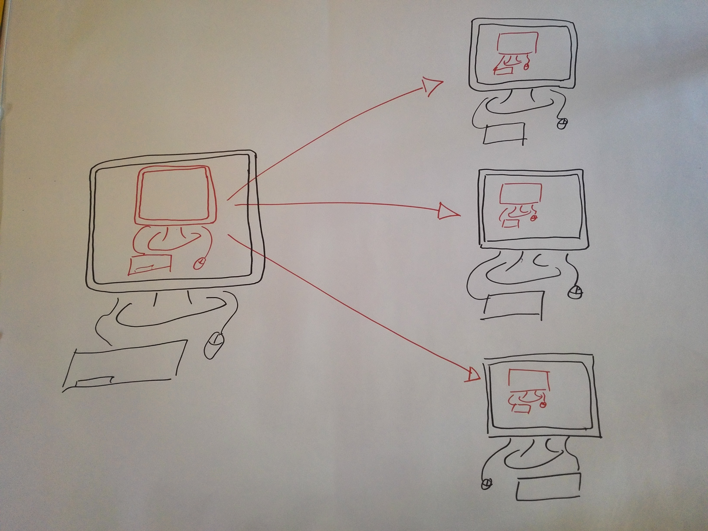

## 학습목표 
- 도커가 출현한 기본개념을 이해한다. 
- 도커가 왜 유용성한지 그 이유를 이해한다.

## 그런데 내가 왜 도커를 사용해야 하나?

여러분이 R로 데이터를 분석한 뒤에 작업한 코드를 친구에게 전송했다고 가정한다.
친구가 정확하게 동일한 데이터셋에 정확하게 동일한 코드를 실행했지만, 결과는 다소 
차이가 나는 결과를 얻는 것은 심심치 않게 목도하게 된다.
이유는 다양한 곳에서 찾을 수 있다: 서로 다른 운영체제, 다른 R 팩키지 버젼 등.
도커는 이와같은 유형의 문제를 풀고자 한다.

**도커 컨테이너는 여러분 컴퓨터 내부에 또다른 컴퓨터로 간주할 수 있다**. 
가상 컴퓨터에 대해서 정말 멋진 기능은 컴퓨터를 친구에게 보낼 수 있다는 것이다;
따라서, 친구가 가상 컴퓨터를 받아 코드를 실행하게 되면, 정확하게 동일한 결과를 얻게 된다는 점이다.

간략하게 줄여서, 도커를 사용해야되는 이유는...

- 운영체제부터 R과 LaTeX 팩키지 버젼같은 세부적인 사항과 연관된 **의존성 문제**를 풀수 있게 해 준다.
- 분석결과가 **재현가능**함을 확실히 보장한다.

도커가 그외에도 도움이 될 수 있는 몇가지 점이 있다:

- **이식성(Portability)**: 도커 컨테이너를 쉽게 또다른 컴퓨터에 보낼 수 있기 때문에,
본인 컴퓨터에서 거의 모든 것을 설정하고 작업준비를 완료한 다음에 훨씬 더 강력한
슈퍼컴퓨터에서 분석코드를 실행시킬 수 있다.
- **공유성(Sharability)**: 도커 컨테이너를 (도커로 작업할 수 있는 방법을 아는) 누구에게나 전달할 수 있다.

## 기본 용어사전

*이미지(image)*와 *컨테이너(container)* 두단어는 학습과정 내내 지속적으로 반복되어 나온다.
이미지에 대한 인스턴스를 컨테이너라고 부른다. 이미지는 가상컴퓨터에 대한 설정이다.
이미지를 실행하게 되면 이미지에 대한 인스턴스를 갖게 되는데 이를 컨테이너라고 부른다.
동일한 이미지에 다수 컨테이너를 실행시킬 수 있다.

다음 수업: [수업 02 도커 실행](02-Launching-Docker.html)으로 진행하거나 
[학습목차](index.html)로 되돌아 간다.
