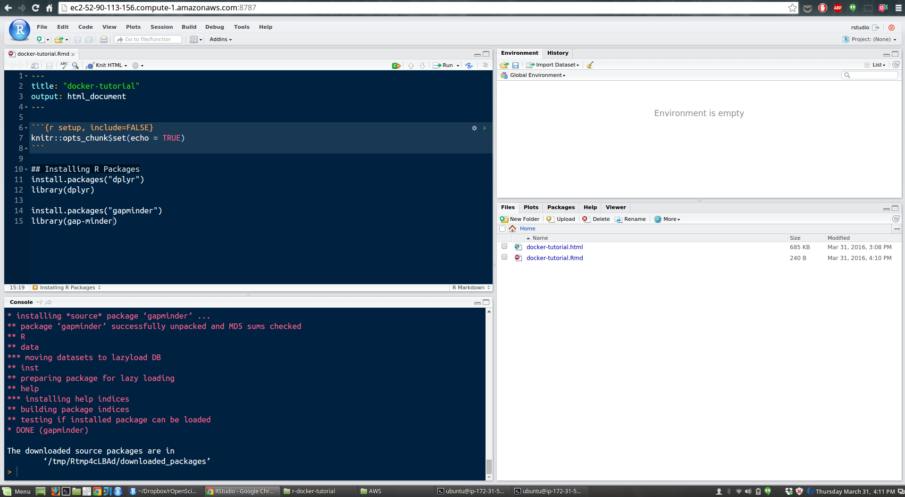

## 학습목표
- 도커 컨테이너 내부에서 RStudio 실행
- 도커 컨테이너에 볼륨 연결
- Load into the container plotting it

## 설치

가장 먼저 해야할 작업: **도커 설치**: [리눅스](https://docs.docker.com/linux/step_one/), [맥](https://docs.docker.com/mac/step_one/),  [윈도우즈](https://docs.docker.com/windows/step_one/). 설치가 완료된 후에 설치안내서에 도커소개학습교재에 대한 링크가 걸려있다; 이번 학습에 도커소개 학습교재를 필히 학습할 필요는 없지만, 기본적인 도커 사용법에 대한 훌륭한 지침서이기는 하다.

## 도커에서 RStudio 실행

도커를 실행하는데 가장 먼저 필요한 선행작업은 유닉스 쉘을 여는 것에서 시작된다. 맥 혹은 윈도우를 운영체제 환경이라면, *Docker Quickstart Terminal* 이라는 것이 설치단계에서 최종이다; 바로 그 터미널을 연다 - 통상적인 쉘프롬프트(`~$`)처럼 보인다. 하지만, 실제로 도커가 실행되는 리눅스 가상컴퓨터를 지칭하고 있다. 이곳이 이번 학습의 모든 것이 수행되는 장소가 된다. 리눅스 컴퓨터에 도커를 올렸으면, 평소 사용하던 터미널을 사용하면 된다.

그 다음으로, 기존에 존재하는 이미지를 도커로 실행시킨다.
[Rocker](https://github.com/rocker-org/rocker/wiki)에서 hadleyverse 도커이미지를 사용한다. 이유는 컨테이너에서 바로 RStudio를 실행할 수 있고, 유용한 다수 R 팩키지가 설치되어 있기 때문에 그렇다.
 

**선택학습**: *`p`와 `--rm` 인자플래그는 컨테이너를 맞춤형으로 실행방법을 지정시킨다. `p` 인자플래그는 포트(나중에 `8787:8787`로 지정)를 사용하여 가상컴퓨터에 접근하도록 지정한다. RStudio를 컨테이너로 실행하는데 필요하다. `--rm` 인자플래그는 컨테이너를 종료시키면, 컨테이너가 삭제되도록 확인하는 기능이다. 이런 작업을 수행하지 않는다면, 컨테이너를 실행할 때마다 로컬컴퓨터에 저장된다. 결국 수작업으로 컨테이너를 삭제하지 않을 때까지 디스크 저장공간의 낭비로 이어진다.
나중에 컨테이너를 저장할 필요가 있는 경우 컨테이너를 저장하는 방법을 보여줄 예정이다.*

~~~
docker run --rm -p 8787:8787 rocker/hadleyverse
~~~

**선택학습**:
*로컬 컴퓨터에 설치되지 않은 도커 컨테이너를 실행할 경우,
도커가 자동으로 도커허브(DockerHub)에서 해당 컨테이너를 찾아 만약 도커허브에 존재하는 경우 다운로드한다.*

상기 명령어를 실행시키면 RStudio-Server가 가시적으로 보이지 않지만 뒤쪽에서 자동으로 실행된다. RStudio-Server에 연결하려면, 웹브라우져를 열고, `http://` 다음에 여러분이 보유한 IP주소를 넣고, `:8787` 포트번호를 넣어준다. 맥 혹은 윈도우즈로 실행한 경우, Docker Quickstart Terminal을 실행할 때 터미널 화면에 고래그림 밑에 IP 주소가 찍힌다. 이를 `http://192.168.99.100:8787` 처럼 넣어준다. 고래그림 밑에 IP주소는 아래처럼 보이게 된다.

~~~

                        ##         .
                  ## ## ##        ==
               ## ## ## ## ##    ===
           /"""""""""""""""""\___/ ===
      ~~~ {~~ ~~~~ ~~~ ~~~~ ~~~ ~ /  ===- ~~~
           \______ o           __/
             \    \         __/
              \____\_______/

docker is configured to use the default machine with IP 192.168.99.100
For help getting started, check out the docs at https://docs.docker.com
~~~

따라서, 웹브라우저에서 `http://192.168.99.100:8787`처럼 url과 포트번호를 넣어 입력하고 엔터를 친다. 

리눅스 운영체제를 실행하는 경우, IP주소로 `localhost`를 넣고 포트번호를 입력한다. 예를 들어: `http://localhost:8787`

맥, 윈도우즈, 리눅스 관계없이 웹브라우져에 RStudio 환영화면이 나오게 된다. 이제 다음 ID와 PW로 로그인한다:

* username: rstudio
* password: rstudio

이제, 로컬컴퓨터에서 작업하는 것과 동일한 환경으로 웹브라우져에서 RStudio로 작업을 할 수 있게 된다.

아래 이미지는 도커이미지 내부에서 돌고 있는 RStudio를 보여주고 있다. 정상적으로 여기까지 따라했다면 유사한 화면이 보일 것이다.

이제 가상컴퓨터(도커 컨테이너)에서 파일을 찾아보자.
`File` &rarr; `Open File...`을 클릭한다.
실제로 파일이 하나도 없다는 것을 알게 된다.
파일이 하나도 없는 이유는 이미지가 어떤 파일도 가지고 오지 않기 때문이다. 다음으로, R스크립트를 생성한다. 즉, `File` &rarr; `R Script`로 간다. 스크립트에 다음 코드를 작성하고, 실행해서 문제가 없는지 확인하고 나서, 저장한다.

~~~
# make x the numbers from 1 to 5, and y the numbers from 6-10
x <- 1:5
y <- 6:10

# plot x against y
plot(x, y)
~~~

파일을 다시 열게 되면, 스크립트 파일이 보이게 된다.

이제 `--rm` 옵션플래그로 도커 컨테이너를 실행했기 때문에 가상컴퓨터(도커 컨테이너)에 생성한 어떤 것이나 없어지게 된다.
이를 확인해보자.
먼저, RStudio가 열린 웹브라우져 탭을 닫고 나서, 도커 컨테이너를 실행시킨 터미널 윈도우로 가서 `Control + C` 를 누른다. 이렇게 하면 도커 컨테이너가 종료된다.

이제 이전에 수행했던 것처럼 RStudio 이미지를 사용해서 도커 컨테이너를 다시 재실행시킨다. 예를 들어, 터미널에서 `docker run --rm -p 8787:8787 rocker/hadleyverse`를 입력하고 나서, 웹브라우져 주소창에 `http://192.168.99.100:8787`을 실행하고 나면 RStudio 환영창이 열리고 ID, PW를 넣어 입력하고 나서 방금전에 저장한 R스크립트가 여전히 존재하는지 확인한다.

## 데이터에 접근하고 파일을 저장하기 위해 도커 컨테이너를 볼륨에 연결

위와 같은 상황은... 컨테이너를 빠져나올 때 컨테이너가 삭제되면 작업할 결과를 어떻게 저장 혹은 살릴 수 있을까? 라는 문제와 직결된다.
해결책 한개를 소개하면 볼륨(예를 들어, 로컬 하드디스크)에 컨테이너를 연결시켜서 그곳을 통해 데이터에 접근할 뿐만 아니라 그곳에 작업 결과를 저장하는 것이다.

이번에는 컨테이너를 실행시킬 때, `-v` 옵션플래그를 작업프로젝트 디렉토리 경로와 함께 사용한다. 컨테이너 실행 명령어는 다음과 유사하다. 물론 경로는 데이터를 컴퓨터와 컨테이너 어디에 저장할지에 따라 다소 차이가 난다. `:` 좌측편에 로컬 컴퓨터 경로가 위치한다. `:` 우측에 컨테이너 경로가 위치한다. 거의 항상 `/home/rstudio/`로 시작한다.

~~~
docker run --rm -p 8787:8787 -v /Users/tiffanytimbers/Documents/DC/r-docker-tutorial:/home/rstudio/r-docker-tutorial rocker/hadleyverse
~~~

다시, 웹브라우져 주소창에 `http://192.168.99.100:8787`을 다시 입력하고 RStudio에 접속한다.

이번에 도커 컨테이너에서 RStudio를 실행하고 나서 파일을 다시 열게 되면, 앞에서 보이지 않던 파일과 디렉토리가 다수 보이게 된다.
이제 작업 디렉토리를 `r-docker-tutorial`로 설정하고 나서, `read.table` 함수로 `gapminder-FiveYearData.csv` 파일을 R로 불러읽어온다.

~~~
# load gapminder data from a csv on your computer
gap5yr <- read.csv(file = 'data/gapminder-FiveYearData.csv')
~~~

이제 기대수명에 대해서 1인당 GDP를 도식화한다.

~~~
# load ggplot library
library(ggplot2)

# plot GDP against  life expectancy
qplot(gap5yr$lifeExp, gap5yr$gdpPercap)

# save the plot
ggsave(filename = 'data/GDP_LifeExp.pdf')
~~~

`r-docker-tutorial` 디렉토리에 `plot_GDP_LifeExp.R` 파일명으로 스크립트를 저장한다. RStudio가 열린 브라우져를 닫고, 터미널에서  `Control+C` 키를 눌러 도커 컨테이너를 빠져나온다.
그리고 나서 로컬 컴퓨터에서 `r-docker-tutorial` 와 `r-docker-tutorial/data` 디렉토리 내부를 살펴보면 파일 두개가 생성된 것을 확인하게 된다.

## 요약정리

이번 학습에서 도커 컨테이너를 실행해서 브라우져로 RStudio를 실행하는 방법을 학습했다. `--rm` 플래그를 사용해서 도커가 컨테이너를 하루살이처럼 일시적으로 만드는 방법도 학습했다; 컨테이너를 닫으면 자동으로 삭제되도록 하는 방법.
이런 방법을 통해 데이터만 남겨놓고 로컬컴퓨터에 매우 커다란 컨테이너를 올려 공간을 낭비하지 않도록 했다. 도커 컨테이너에 로컬 컴퓨터 볼륨을 연결시키는 것도 학습했다. 이를 통해 로컬 컴퓨터와 도커 컨테이너 사이에 데이터, 스크립트 뿐만 아니라 다른 파일들도 접근가능하고 저장 삭제가 가능하게 되었다.

방금전에 사용한 컨테이너에는 R, RStudio, 유용한 R 팩키지가 사전에 설치되어 있다. 다음 학습에서 신규 팩키지를 설치해서 컨테이너를 변경시키는 방법을 학습하고, 진행되는 프로젝트에 유용한 도커 컨테이너를 찾아내는 방법도 학습할 것이다.

## 도전 과제

다음 수업: [수업 03 팩키지 설치](03-install-packages.html)으로 진행하거나 
[학습목차](index.html)로 되돌아 간다.