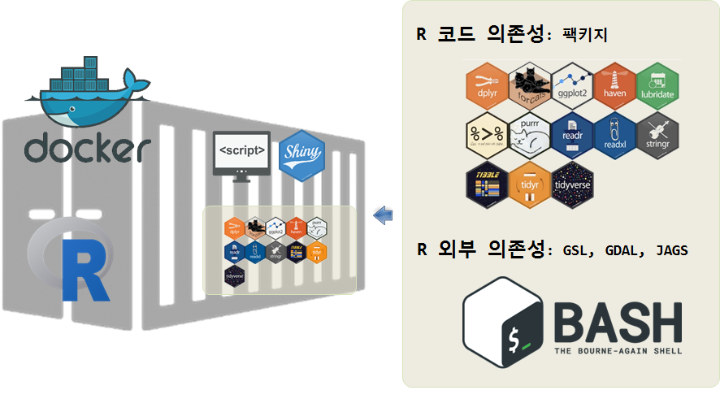

## 1. 데이터 과학 자체 도커 이미지 생성 {#r-docker-commit}

`docker pull`을 통해 `rocker/rstudio` 이미지를 받게 되면 데이터 과학 작업을 시작할 수 있는 좋은 밑바탕이 마련된다.
하지만, 팩키지도 설치해야 되고 경우에 따라서는 윈도우의 `Rtools`와 같은 도구를 설치해서 작업을 해야되는 경우가 많다.
이와 같은 상황을 두가지로 나눠 설명을 해보면, 하나는 팩키지와 같은 R 내부 (데이터가 포함된) 팩키지를 설치하는 경우와 
운영체제 배쉬와 같은 쉘을 통해 다양한 소프트웨어를 설치하는 과정으로 나누게 된다.

두가지 경우 모두 도커 컨테이너에 설치된 것이라 이를 다시 활용하기 위해서는 `docker commit` 명령어를 통해 나중에 
재활용할 수 있는 이미지를 생성켜 놓는다.



## 2. RStudio 내부 R 팩키지 설치 {#r-docker-pkg-commit}

`install.packages` 명령어를 사용해서 데스크톱 RStudio 세션에서 작업했던 것과 동일한 방식으로 웹브라우져로 RStudio에서 R 팩키지를 설치할 수 있다.
`hadleyverse` 도커 컨테이너를 실행해서 앞선 학습처럼 RStudio를 실행한다. 그리고 나서 `gapminder` 팩키지를 설치하고 라이브러리를 적재하고 포함된 데이터를 살짝 살펴본다.

``` {r r-docker-install-pkg}
# 팩키지 설치
# install.packages('gapminder')

# gapminder 라이브러리 적재
library(gapminder)

# 데이터 살펴보기
head(gapminder)
```

아주 훌륭하다! 이제 `gapminder` 팩키지를 설치했기 때문에 팩키지에 포함된 모든 데이터를 갖고 작업할 수 있게 되었다.
그런데, 여기서 잠깐. 컨테이너를 빠져나가면 어떻게 될까?
컨테이너가 삭제된다. 따라서 도커 이미지에 `gapminder` 팩키지가 설치된 버전을 저장하지 않았기 때문에, 컨테이너를 다시 올리게 되면, 다시 `gapminder` 팩키지를 설치해야 되는 상황이 발생된다.

이런 문제를 회피하기 위해서, `docker commit` 명령어를 사용해서 이미지를 저장한다. 이런 경우 다음번 도커 컨테이너를 실행시키면 `gapminder` 팩키지가 포함된 이미지 인스턴스가 실행된다. 이렇게 작업을 실행하고자 하면, 도커 컨테이너를 닫기 **전**에 또다른 터미널 윈도우를 열고 추가 작업을 진행한다.

특정 이미지 버젼을 저장하려면, 해당 컨테이너에 딸려있는 특정 해쉬값을 찾아야 된다. 새로 연 터미널 윈도우에 다음 명령어를 타이핑하게 되면 이런 정보를 확인하게 된다. `docker ps` 명령어를 통해 실행되고 있는 모든 도커 컨테이너를 볼 수 있게 된다:

``` {r r-docker-ps, eval = FALSE}
$ docker ps
```

출력결과는 다음에 나온 것처럼 보이게 된다.
특정 컨테이너에 딸린 특정 해쉬값이 첫번째 칼럼에 알파벳과 숫자가 섞인 텍스트로 나타나게 된다.

``` {r r-docker-ps-output, eval = FALSE}
f9ca71428352        rocker/hadleyverse   "/init"             6 seconds ago       Up 5 seconds        1410/tcp, 0.0.0.0:8787->8787/tcp   sick_bhabha
```

이제, 작업한 이미지를 저장하려면, 새로 연 터미널 윈도우에 다음과 같이 타이핑한다:

``` {r r-docker-ps-commit, eval = FALSE}
$ docker commit -m "hadleyverse + gapminder" f9ca71428352 hadleyverse_gapminder
```

도커 이미지를 저장하는데 이미지에 변경한 사항을 기술하는데 메시지를 추가해서 커밋한다. 커밋 메시지를 넘기는 방법은 `-m` 플래그 다음에 인용부호를 메시지에 감싸서 전달한다. 컨테이너에 대한 특정 해쉬값도 전달한다. (본 사례로 f9ca71428352) 마지막으로 신규 이미지에 대한 새로운 명칭을 부여한다.
새로 생성한 이미지에 `hadleyverse_gapminder` 라는 명칭을 부여했다.

`docker images` 명령어를 입력하면 로컬 컴퓨터에 도커 이미지가 두개 생성된 것이 확인된다.

``` {r r-docker-ps-images, eval = FALSE}
$ docker images 

REPOSITORY              TAG                 IMAGE ID            CREATED             SIZE
hadleyverse_gapminder   latest              1cf34acb0d60        30 minutes ago      2.84 GB
rocker/hadleyverse      latest              7cba8b06f25e        9 days ago          2.838 GB
```

작업한 결과가 예상한대로 돌아가는지 확인하려면 각 이미지에서 도커 컨테이너를 실행해서 확인한다. 
`gapminder` 팩키지가 `hadleyverse_gapminder` 이미지에만 설치되고, `rocker/hadleyverse` 이미지에는 설치가 되지 않은 것이 확인되면 모든 작업은 성공적으로 완료된 것이다.

## 3. R 시스템에 외부 의존성을 설치하는 경우 {#r-docker-bash-commit}

GSL, GDAL, JAGS 등 다양한 외부 시스템에 R 팩키지가 의존성을 갖는 경우가 있다.
`rocker/hadleyverse` 컨테이너에 이런 외부 시스템을 설치하려면, 도커 명령라인 인터페이스(새창으로 터미널을 연다)로 들어가서 다음 명령어를 타이핑한다:

``` {r external-dependencies, eval=FALSE}
$ docker ps # 외부 의존성 툴을 설치할 콘테이너 ID를 찾아냄
$ docker exec -it <container-id> bash # 해당 콘테이너 ID를 넣고 배쉬쉘을 실행
$ apt-get install libgsl0-dev # 툴을 설치, 이번 경우에 GSL 설치
```

`apt-get install libgsl0-dev` 명령어를 실행할 때 오류 메시지가 뜨는 경우 
`apt-get update` 명령어를 먼저 실행시킨다.

외부 의존성을 설치한 변경내역을 저장하려면 또다른 터미널창으로 가서 `docker commit` 명령어를 사용해서 변경내역을 저장시킨다. 예를 들어,

``` {r external-dependencies-commit, eval=FALSE}
$ docker commit -m "hadleyverse + gapminder + GSL" <container id>  hadleyverse_gapminder_gsl
```

이제, `docker exec` 명령어를 타이핑한 터미널 창으로 가서 `exit`를 입력하고 도커 컨테이너를 닫는다.


다음 수업: [수업 04 도커허브(Dockerhub)](04-Dockerhub.html)으로 진행하거나 
[학습목차](index.html)로 되돌아 간다.

