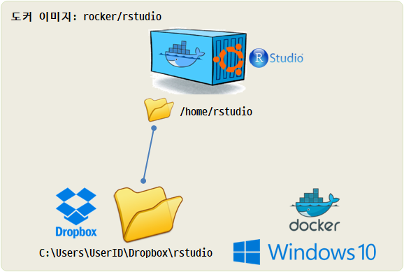
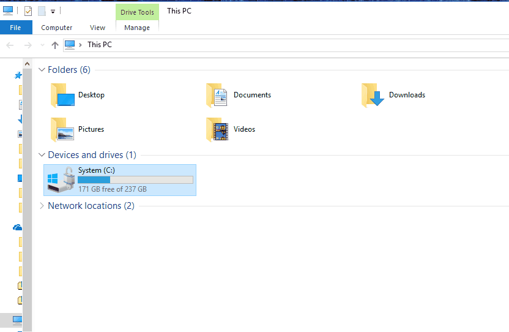
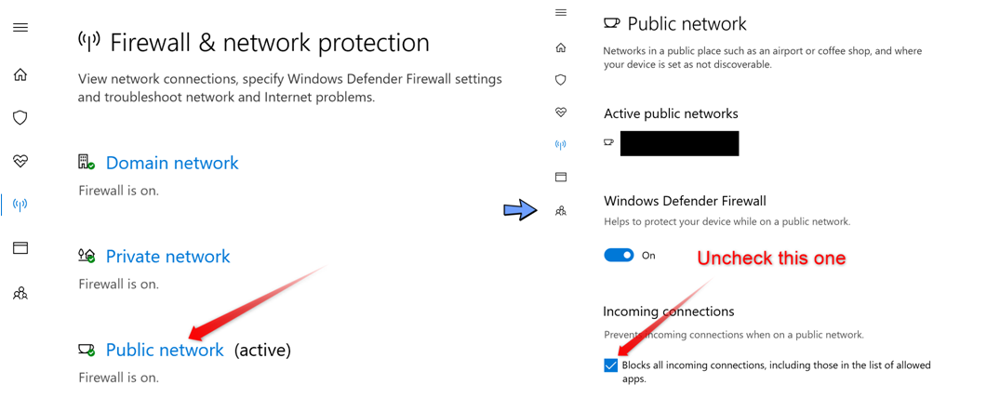

# 윈도우 도커(docker) 설치 [^windows-docker] {#windows-docker}

[^windows-docker]: [docker - 도커 처음 사용자를 위한 윈도우 도커 설치 및 실행하기](https://steemit.com/kr/@mystarlight/docker)

"윈도우7, 윈도우 10 홈 버전 이하"와 "윈도우 10 프로 이상 또는 윈도우 서버 2016 버전"에서 두가지 설치파일이 있으니 
로컬 컴퓨터 운영체제에 맞춰 도커를 설치하면 된다.

도커가 설치되면 "명령 프롬프트"를 실행해서 터미널을 띄운다.

## 데이터과학 이미지 {#windows-docker-image}

윈도우에서 데이터과학을 위해서 RStudio와 R이 포함된 이미지를 도커 허브에서 다운로드 받는다.
[Rocker 프로젝트](https://hub.docker.com/u/rocker/)를 통해서 최신 R관련 도커 이미지가 사용하기 편하게 제공되고 있다.

``` {r local-machine-container, eval = FALSE}
$ docker pull rocker/rstudio
```

## 데이터과학 컨테이너 [^docker-commands] {#windows-docker-container}

[^docker-commands]: [evanscottgray/docker_kill.sh](https://gist.github.com/evanscottgray/8571828)

다운로드 받은 이미지를 컨테이너로 실행을 시킨다. `--name`을 인자로 넘기게 되면 사용하기 편리한다.
`docker container ls` 명령어로 컨테이너가 떠있는 것이 확인되었고 다음으로 `http://localhost:28787/` 웹브라우저에서 28787 포트를 통해 컨테이너로 접근해서 RStudio IDE를 열고 데이터과학 분석작업을 수행하면 된다.

``` {r local-machine-container-run, eval = FALSE}
$ docker run -d --name rstudio -p 28787:8787 rocker/rstudio
$ docker container ls
CONTAINER ID  IMAGE           COMMAND  CREATED        STATUS      PORTS                     NAMES
31eb52fd34a8  rocker/rstudio  "/init"  30 minutes ago Up 1 second 0.0.0.0:28787->8787/tcp   rstudio
```

컨테이너를 중지시키고 다시 시작하는 명령어를 알아두면 다음에 다시 컨테이너를 새로 만들 필요가 없어 유용하다.
앞서 `CONTAINER ID` 대신에 `NAMES`를 사용할 수 있도록 조치를 했기 때문에 `docker container stop`, `docker container restart` 명령어로 원하는 바를 달성하기 쉽게 되었다.

``` {r local-machine-container-ops, eval = FALSE}
$ docker container stop rstudio
$ docker container restart rstudio
```

현재 떠있는 도커 컨테이너에 `bash` 접속하는 방법은 다음과 같다. [^docker-container-ssh]
`docker exec -it <컨테이너명> bash` 명령어를 사용한다.

[^docker-container-ssh]: [Stackoverflow - How do I get into a Docker container?](https://stackoverflow.com/questions/30172605/how-do-i-get-into-a-docker-container)

``` {r local-machine-container-ssh, eval = FALSE}
$ docker exec -it rstudio bash
root@31eb52fd34a8:/# 
```


## 컨테이너 디렉토리 연결 {#windows-docker-container-volume}

도커 이미지에서 컨테이너를 생성시키게 되면 컨테이너 자체는 `하루살이(ephemeral)`와 같은 상황이라 열심히 분석하고 모형을 작성한 것이 
어느 한순간 날아갈 수가 있다. 이것을 방지하기 위해서 컨테이너를 생성시킬 때 `-v` 선택옵션으로 호스트 컴퓨터의 
디렉토리와 컨테이너 운영체제(우분투) 디렉토리를 동기화시킨다.



앞서 `rocker/rstudio` 이미지를 다운로드 받아 컨테이너를 생성시키게 되면 우분투 운영체제에 `/home/rstuido` 디렉토리가 생성되어 있다.
윈도우 호스트 컴퓨터 드롭박스의 `C:/Users/UserID/Dropbox/rstudio` 디렉토리와 도커 `/home/rstudio` 콘테이너가 동기화되어 하루살이 콘테이너가 날아가도 
데이터는 윈도우 호스트 컴퓨터 드롭박스의 `C:/Users/UserID/Dropbox/rstudio` 디렉토리에 남게 된다.


``` {r local-machine-container-volume, eval = FALSE}
$ docker run --rm -v C:/Users/UserID/Dropbox/rstudio:/home/rstudio -d --name rstudio -p 28787:8787 rocker/rstudio 
```

### 문제해결(troubleshooting) {#windows-docker-container-volume-trouble}

윈도우에서 `-v` 선택옵션을 통해 호스트 컴퓨터 디렉토리와 도커 컨테이너 디렉토리를 연결하는 생각보다 예기치 못한 난관이 발생되게 되는데 이 경우
다음 사항을 검토하여 해결해 나간다.

윈도우 우측 아래에서 도커 **설정(Settings)**을 클릭하면 좌측에 `General`, `Shared Drives`, ... 등등 메뉴가 나열된다.
`Shared Drives`에서 공유하고자 하는 드라이브를 다음과 같이 설정한다. 이런 이유가 필요한 이유는 방화벽과 관련된다.
일차적으로 `Firewall detected` 메시지가 나오는 경우에 해당된다. [^docker-for-windows-shared-drives] [^docker-firewall]

[^docker-for-windows-shared-drives]: [docker docs - Docker for Windows - Getting started - Shared drives](https://docs.docker.com/docker-for-windows/#shared-drives)

[^docker-firewall]: [Error: A firewall is blocking file Sharing between Windows and the containers](https://github.com/docker/for-win/issues/355)



다음으로 `제어판` &rarr; `시스템 및 보안` &rarr; `Windows Defender 방화벽` &rarr; `게스트 또는 공용 네트워크(P)`에서 **Windows Defender 방화벽 설정 또는 해제**를 
선택해서 **허용되는 앱 목록에 있는 연결을 포함하여 모든 들어오는 연결 차단**을 체크하지 않고 풀어놓는다. [^docker-public-network]

[^docker-public-network]: [stackoverflow - Settings to Windows Firewall to allow Docker for Windows to share drive](https://stackoverflow.com/questions/42203488/settings-to-windows-firewall-to-allow-docker-for-windows-to-share-drive)




